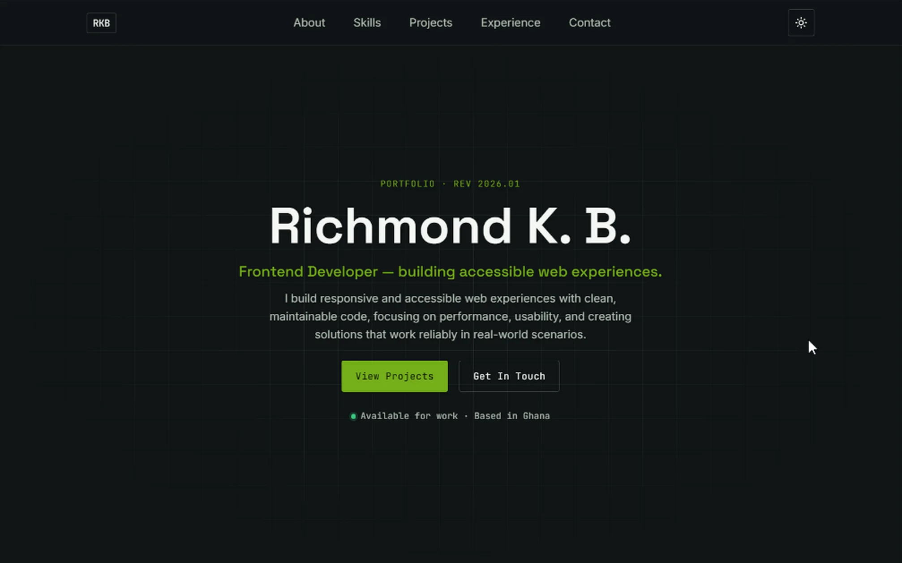

# 💼 My Portfolio

A modern, responsive developer portfolio showcasing my skills, projects, and journey as a software developer.

<div align="center">

[](https://krowey-richmond.vercel.app/)

</div>

## 🌐 Live Demo

[](https://krowey-richmond.vercel.app/)

## 📂 GitHub Repository

## [](https://github.com/krowey-richmond/portfolio)

## 📖 About

This portfolio was built to:

- Showcase my projects
- Highlight my technical skills
- Provide an easy way to contact me
- Track my growth as a developer

The website is fully responsive and optimized for desktop, tablet, and mobile devices.

---

## ✨ Features

- Responsive design
- Modern UI
- Smooth scrolling
- Project showcase
- Skills section
- About section
- Contact section
- Downloadable CV
- Social media links
- Clean and accessible code

---

## 🛠️ Built With

- HTML5
- CSS3
- JavaScript (ES6+)

Future versions may include:

- React
- Tailwind CSS
- Framer Motion
- EmailJS
- Node.js

---

## 📁 Folder Structure

```

portfolio/
│
├── assets/
│   ├── images/
│   ├── screenshots/
│   ├── icons/
│   ├── Richmond-CV.pdf
│   └── preview.png
│
├── css/
│   └── style.css
│
├── js/
│   ├── main.js
│   └── script.js
│
├── data/
│   └── projects.js
│
├── index.html
└── README.md

```

---

## 🚀 Getting Started

Clone the repository:

```bash
git clone https://github.com/krowey-richmond/portfolio.git
```

Navigate into the project:

```bash
cd portfolio
```

Open `index.html` in your browser or use a Live Server extension.

---

## 📸 Screenshots

Check the [folder](https://github.com/krowey-richmond/portfolio/tree/main/assets/screenshots) for screenshots.

## 🎯 Future Improvements

- Dark mode
- Blog section
- Project filtering
- Animations
- Backend contact form
- CMS integration
- Internationalization (i18n)

---

## 🤝 Contributing

Contributions, suggestions, and feedback are welcome.

1. Fork the repository
2. Create a feature branch
3. Commit your changes
4. Push to your branch
5. Open a Pull Request

---

## 📬 Contact

### [](https://github.com/krowey-richmond)
### [](https://linkedin.com/in/krowey-richmond)
### [](mailto:kroweyrichmond2004@email.com)

---

## 📄 License

This project is licensed under the MIT License.

---

## ⭐ Support

If you found this project useful, consider giving it a ⭐ on GitHub.
